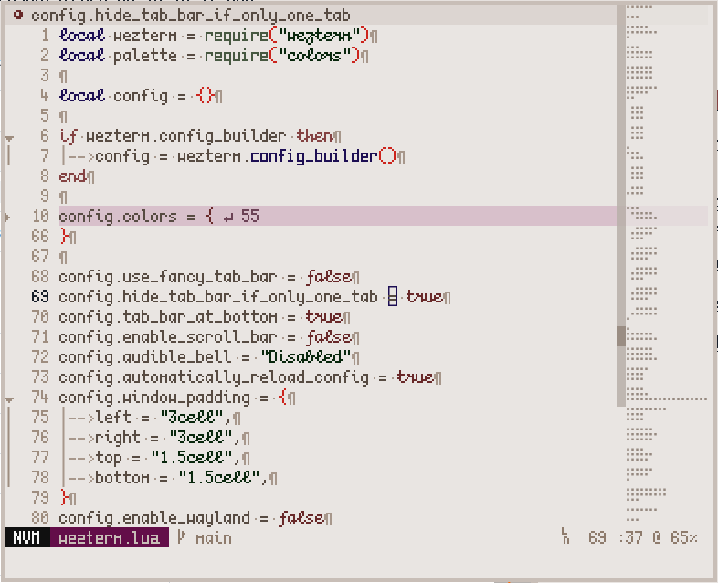

# NeoBim

__lckdscl's opinionated configuration of Neovim.__

## Plugin manager

Requires (lazy.nvim)[https://github.com/folke/lazy.nvim] as the plugin manager.

## Configured language servers

- Python
- Lua
- Tex 
- Vim

## Other linters

- prettierd
- black
- chktex
- cppcheck
- codespell
- vint
- proselint
- pylint
- shellcheck
- stylua
- latexindent
