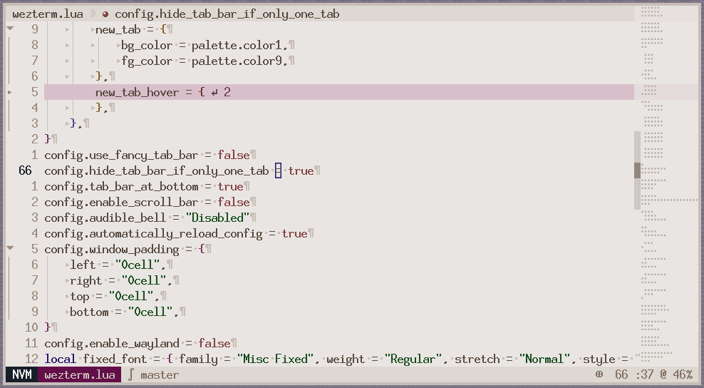

# nvim

**lckdscl's opinionated configuration of Neovim.**



## Features

- An actual IDE with ~40 ms start-up time.

## Get started

### Cloning

```sh
$ git clone -b master https://github.com/mstcl/nvim
$ cd nvim
```

### Configuration

```sh
$ git checkout -B prod
```

Read through what's available to configure in `host_vars/localhost.yml` and
edit it.

### Installing

When you're happy:

```sh
$ ansible-playbook main.yml
```

## Updating

```sh
$ git checkout master; git pull origin master; git checkout prod; git merge master
```

Work through conflicts if needed.
