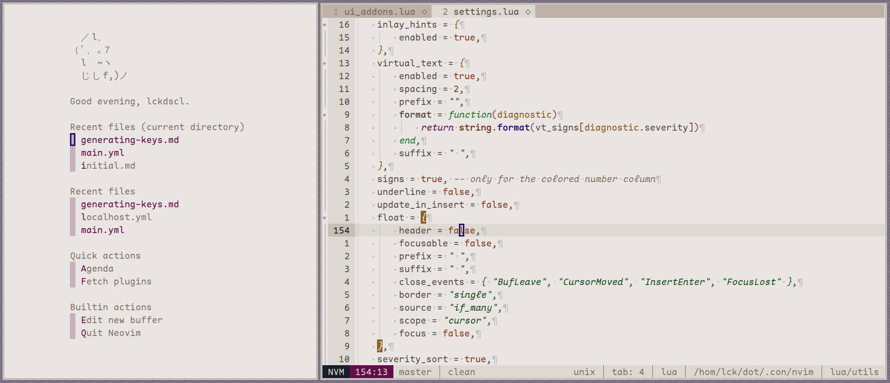

# NeoBim

**lckdscl's opinionated configuration of Neovim.**

## Plugin manager

Requires [lazy.nvim](https://github.com/folke/lazy.nvim) as the plugin manager.

## Configuration

There are some configurations that are easily edited in `user_configs.lua`.
Follow the comments in there.

Also, the configuration is to be used with my
[colorscheme](https://github.com/mstcl/dmg). Shit might break otherwise but you
can probably fix it.
